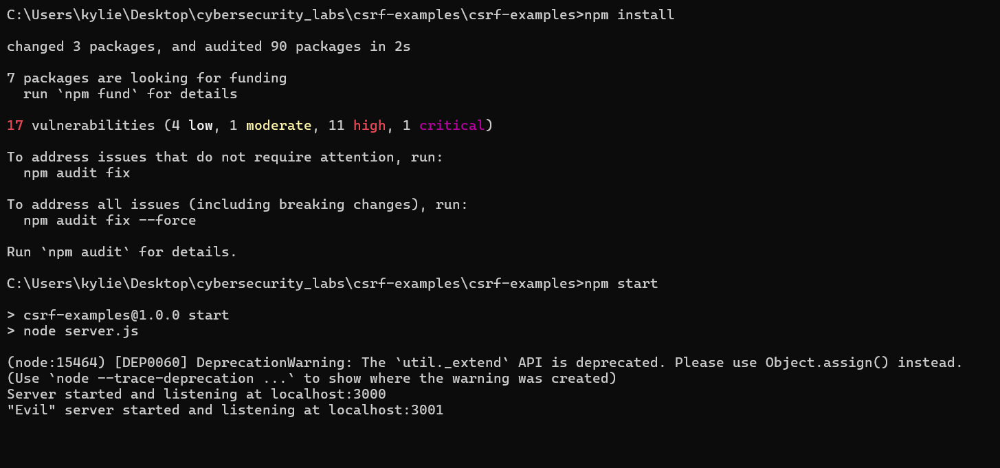
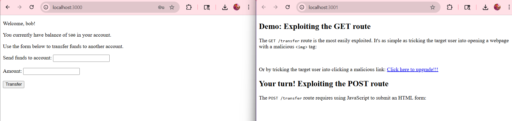
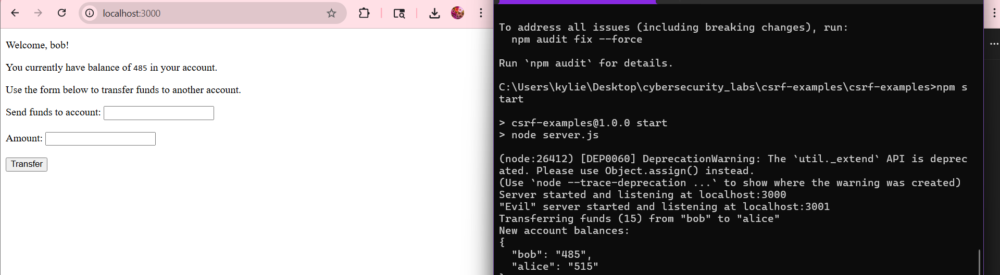
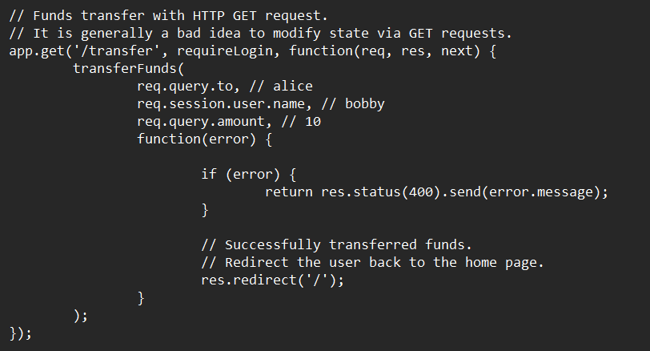
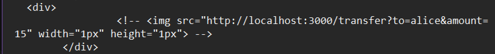
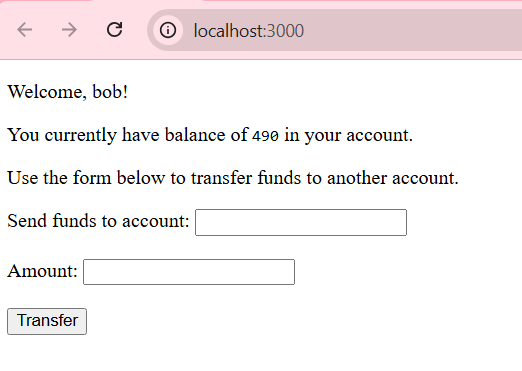

# Cross Site Request Forgery Lab

---

Before beginning:
1) Downloaded Node.js.
2) Downloaded zip file.
3) Moved to the lab folder.

User Tasks:

4) I entered "npm install" to install dev dependencies and "npm start" to start the server.

5a) The initial balance on the target site was 500.

5b) After opening the malicious page and refreshing it, the balance changed to 485. This happened because the malicious site sent a GET request to the target website using Bob's session, since he was logged in. The target site does not have CSRF protection and allowed the browser to transfer $15 into Alice's account.

6) This snippet of code from "server.js" makes the website vulberable to a CSRF attack because it uses cookies for authentication (req.session.user.name) and there is nothing to confirm that a request is actually coming from the transfer form on the main website.

7) In the "evil-examples.html" file I commented out the malicious img tag that was creating the CSRF attack.

8a) Here is the code that was added into "evil-examples.html". It creates a form dynamically and the request type is set to POST. The fields in the form are hidden so after the form is made, it gets added to the current web page. Then it submits the form automatically.

8b) After changing the code, logging in as Bob, and clicking the malicious link, $10 is deducted from Bob's account.

9) One countermeasure to CSRF is Same Site cookies. It is a special type of cookies in browsers that gives an attribute to cookies called SameSite. It is set by servers and lets browsers know whether a cookie is allowed to be attached to a cross-site request or not. The attributes assigned to the cookies can be strict (only sent in a first-party context), lax (sent when a user navogates to another site), or none (sent in all contexts).
