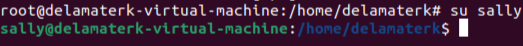

# Exploring Ubuntu Home Lab

---

Before beginning:
1) Ran 'sudo apt update' to refresh my package index and show my system which packages could be updated.
2) Ran 'sudo apt upgrade' to install any updates my system needed.
3) Ran 'sudo reboot' to guarantee the system applied all updates consistently.

User Tasks:

4) I switched to the root user, which can differentiated by the # at the end of the line rather than a $. It is also root@ instead of delamaterk@.

5) The useradd command only creates the user, while adduser uses a perl script to create a password and home directory for the user. As you can see, I had trouble with setting the password because I though bad password meant I had to do a different password.

6) Using the 'su' command, I switched to the user sally I created in the previous step. Now, the prompt has sally@ instead of root@ and has switched from # back to $. 

7) I tried to add a new user named earl while I was sally, which it did not allow me to do because the user is not the root user/does not have sudo privileges.

8) I used the exit command twice to return to my user 'delamaterk'. Then, I did 'userdel earl' to ensure the user was not created by sally.

9) I was able to change sally's password using 'sudo passwd sally' because I have sudo privileges.

10) For the rest of my tasks I will stay logged in as my user because it is bad practice to stay logged in as root. Running commands as the root user reduces security, can easily damage the system, and there is little accountability for any actions.

11) Using the 'id' command, I can see that my user id is 1000.

Group Tasks:

12) The groups command shows all of the groups that I am apart of.

13) I used 'usermod -a -G' to add sally to the sudo group. The '-a' stands for append and the '-G' indicates group. Then I switched users to sally to check she was successfully added, which she was. Then, I used 'useradd' to add a new user, which could now be done when I was logged in as sally because she was added to the sudo group.

14) I used the 'groupadd' command to create a group called cybersec.

15) I used 'usermod -a -G' to add sally to the new cybersec group.

16) From my user login, I was able to check what groups sally is in using 'groups sally'.

