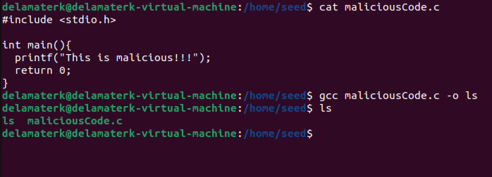
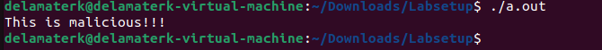
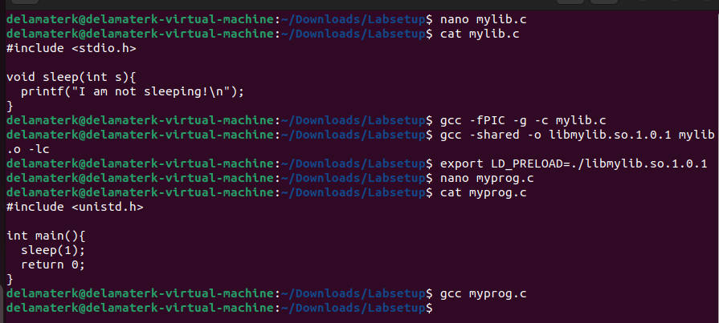

# SEED Lab on EV's and Set-UID

---

Task 1: Manipulating Environment Variables

^^Print out environment variables using "printenv" command.

^^Use "export nameOfEV" to set an environment variable and "unset nameOfEV" to unset an environment variable.

Task 2: Passing Environment Variables from Parent Process to Child Process

^^I navigated to the "Labsetup" folder provided by the SEED Lab and compiled "myprintenv.c". This produced an executable named "a.out", which was then ran and its output was placed into a file.

^^I edited "myprintenv.c" to print out the parent process EV's instead of the child process EV's using nano. I recompiled the program and placed the output into another file, named file2.

^^Then, I used the "diff" command to compare the EV's of the child process to the EV's of the parent process. The terminal was clear, meaning there was no difference. Therefore, I can conclude that a child process inherits its environment variables from the parent process.

Task 3: Environment Variables and execve()

^^I compiled "myenv.c" and ran it, but there was no output.

^^I edited the "myenv.c" program using nano, changing NULL to environ in the execve() function call. After recompiling and running the program, it output my environment variables. 

The new program gets its environment variables from environ in execve(), otherwise it does not have access to the EV's.

Task 4: Environment Variables and system()

^^Using pico, I created a file "systemexample.c" that calls the system() function to execute "/usr/bin/env". I compiled and ran this program, which output the environment variables.

Task 5: Environment Variable and Set-UID Programs

^^I created "setUIDex.c" in nano that prints all environment variables. I compiled it and changed the owner of the c file and output file to root and made it a setUID program. I wasn't sure if both the c file and output needed these changes, but I did both. Then, I used "ls -l" to confirm the changes were made.

^^Here, I set the PATH, LD_LIBRARY_PATH, and MY_ENV and used "printenv" to make sure my changes worked. I ran "a.out" and found PATH and MY_ENV in the list of environment variables, but did not find LD_LIBRARY_PATH. So, when the program is Set-UID, not all EV's get passed to the child process. 

Task 6: The PATH Environment Variable and Set-UID Programs

^^I had some trouble with this section. I was able to add "/home/seed" to the beginning of PATH, create the c file that calls system() and runs ls, change the owner to root, and make it a set-UID program. I ran the program and it ran the ls command. I realized I needed to create malicious code in the "home/seed" directory.

^^I went to the home directory and used "mkdir" to create a directory named "seed". It is not pictured here, but I used touch to create the "maliciousCode.c" file and nano to edit it and put a basic print function that just said a malicious program was being run. Then, I compiled the program and called the output file "ls". I did run into a couple permission issues along the way, but I used "chmod" so I was able to edit the C file and execute it.

^^I returned to the Labsetup directory where my c file that calls ls using system() was. I ran the program again and it called the malicious program in "home/seed" instead of the "ls" in /bin (?). I assume my malicious code is running with root privileges since the seed directory and "maliciousCode.c" are both owned by root.

Task 7: The LD PRELOAD Environment Variable and Set-UID Programs

^^I followed the steps in the SEED lab instructions. I created "mylib.c", compiled it, set the LD_PRELOAD environment variable, created "myprog.c", and compiled it.

^^I ran "myprog.c" as is and it printed "I am not sleeping!". I changed the owner to root and made it a set-UID program. When I reran the program, it output nothing and perfomed the sleep(1) operation. Then, I switched to the root user, reset the LD_PREOAD EV, and ran the program which output "I am not sleeping!". Finally, I changed the owner to "sally", made it a set-UID, reloaded the EV, and when it was ran it did sleep(1).

The differences in these are most likely due to security/permission limitations, set-UID programs, and the environment variables. Running the program as a normal user and non-set-UID, LD_PRELOAD is honored by the program, so it says it isn't sleeping. Likewise, when it was a set-UID root program and run by root, it will use LD_PRELOAD because there is nothing to stop it. When it was run as a set-UID root program by a normal user and when it was a set-UID program by sally and run by a different user, it does sleep(1). I did not really understand why this was happening, so I did a bit of research to find it was because there was a change in real user ID vs effective user ID. So, if they're the same, the "I am not sleeping!" print line will come up, but if they're different it will do sleep(1). An experiment to show this could be a program that prints out the real user ID and effective user ID at the time of running "./a.out"

Task 8: Invoking External Programs Using system() versus execve()

^^I compiled the "catall.c" program, changed the owner to root, made it a set-UID program, and ran "ls" to confirm the changes were made.

^^I created a test file called "task8ex" that contained nothing. Then, I ran the "catall.c" program and added "";/bin/sh"" to the end of the file name. It opened up a shell and I was able to delete the "task8ex" file. I attempted to get a root shell by changing the owner of "task8ex" to root, but was unsuccessful.

^^I changed the use of system() to execve(), recompiled the program, and made it a root owned set-UID program. I attempted the same input as the previous step but received a "No such file or directory" error.

My attack worked with system() and not execve() because system combines code and data. It reads the command as command, whereas execve() reads the entire input as a string. Basically, system() has no 
input validation, so it's vulnerable to an attack like this.

Task 9: Capability Leaking

^^I compiled "cap_leak.c" and made it a root owned set-UID program

^^I moved to the etc folder and created a file named "zzz"

^^I ran "cap_leak.c" and I began trying different things trying to write to it. I attempted nano and vim, but was not successful with either of them because of permission issues. I decided to terminate the program and, for some reason, when I exited the shell I had a root shell. I do not know how this happened and I'm unsure if it's related to the capability leaking program or not. 

^^Here's the root shell that opened. 

While I was unsuccessful in writing to the file for the capability leaking example, I did open a root shell accidentally. I'm wondering if I just do not know enough about Linux commands or how to find the vulnerabilities. Online resourcers weren't able to help me out here either.

 

